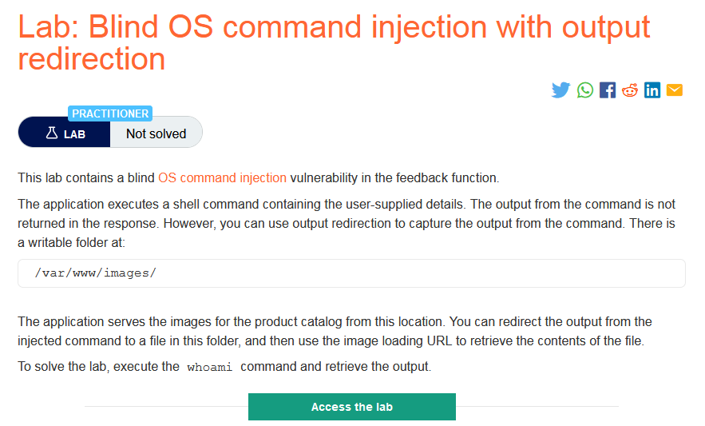
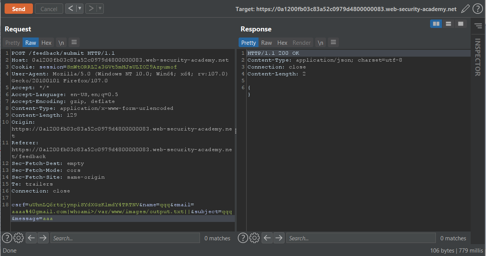
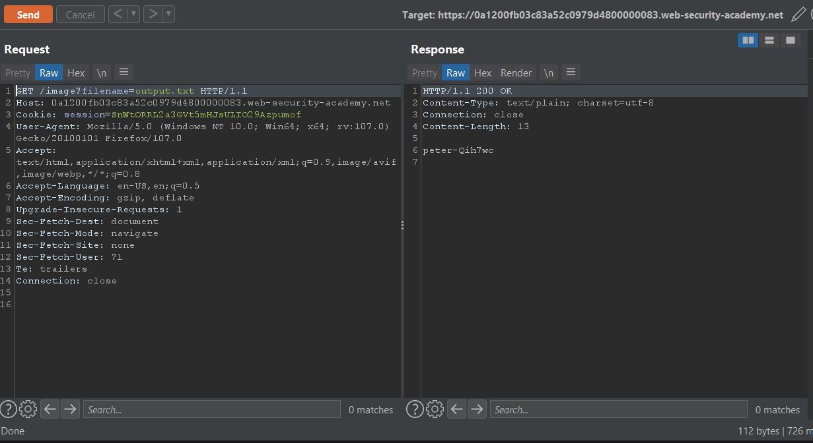

### Giải quyết
- Mô tả phòng thì nghiệm cho biết có lỗ hổng blind OS command injection trong chức năng feedback, kết quả từ command không trả về trong phản hồi, có thể chuyển hướng đầu ra và ra file trong thư mục `/var/www/images/`
- Thực hiện submit feedback và bắt request chuyển tới Burp Repeater.
- Có thể sử dụng ký tự `; || # và |` trong payload để thực hiện điều hướng output lệnh whoami. Payload:
`email=a@gmail.com;whoami>/var/www/images/output.txt;#&subject=...`
hoặc
`email=a@gmail.com|whoami>/var/www/images/output.txt||&subject=...`

- Đổi giá trị filename để mở file.

###### Solved!
