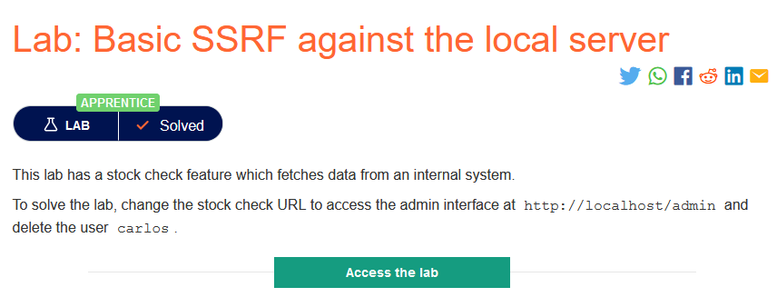
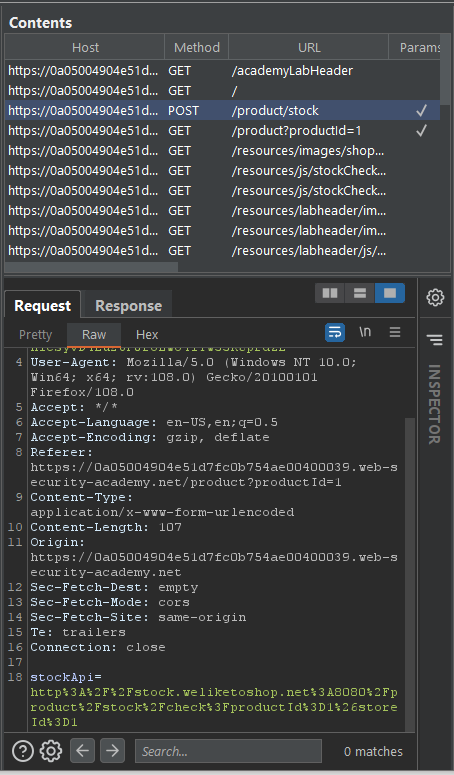
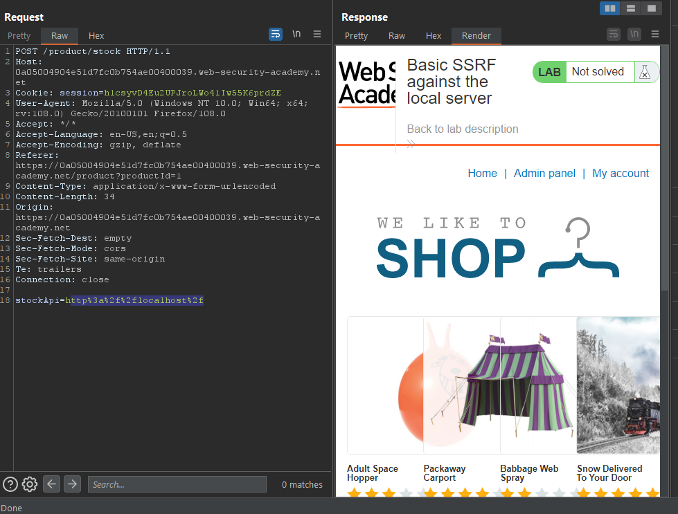
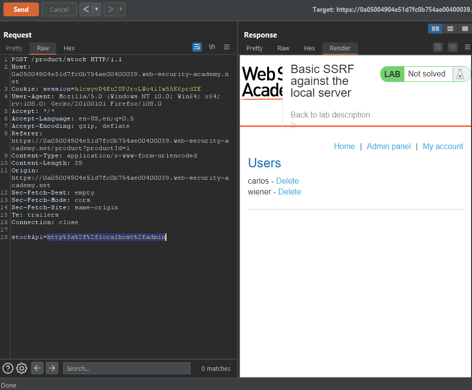
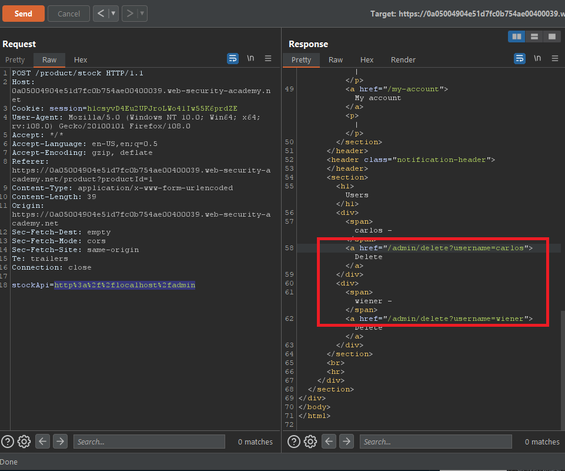
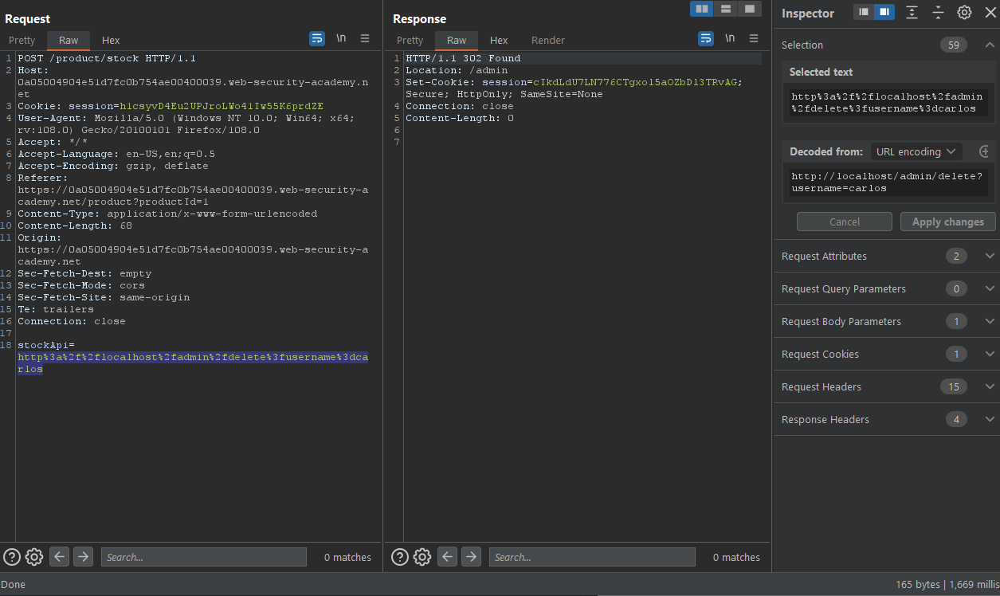
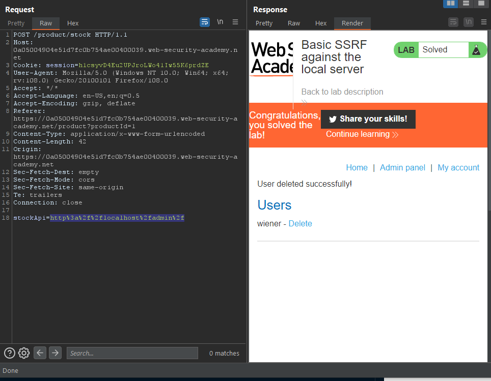

### Giải quyết
- Phân tích ứng dụng web:
    - Trang web công khai là 1 trang mua sắm chỉ có chức năng đăng nhập và kiểm tra số lượng mặt hàng còn lại
    
    - Khi sử dụng chức năng kiểm tra mặt hàng: Có vẻ như tham số stockApi đang yêu cầu HTTP/URL, điều này có thể dẫn đến lỗ hổng SSRF nếu các biện pháp kiểm soát phòng ngừa chưa được triển khai đúng cách. 
    
- Khai thác:
    - Thử attack vào chính server ứng dụng web (thông qua loopback network interface với hostname kiểu 127.0.0.1 hoặc localhost)
    
    - Xuất hiện `Admin panel`, thử request đến `Admin panel`
    
    - Tiếp theo thử kiểm tra thấy liên kết để xóa tài khoản carlos 
    
    - Sửa URL để gửi request xóa tài khoản carlos.
    
    - Request được gửi thành cô, có thể quay lại `Admin panel` để kiểm tra.
    
###### Solved!
