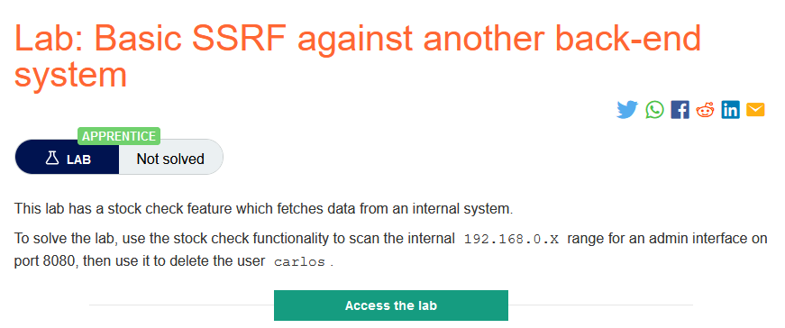
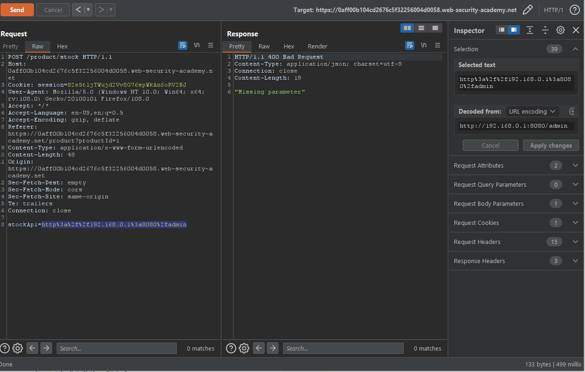
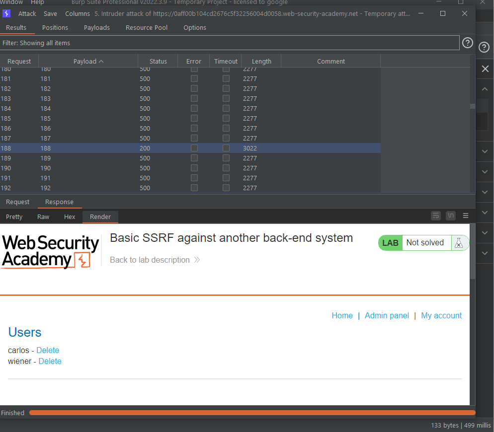
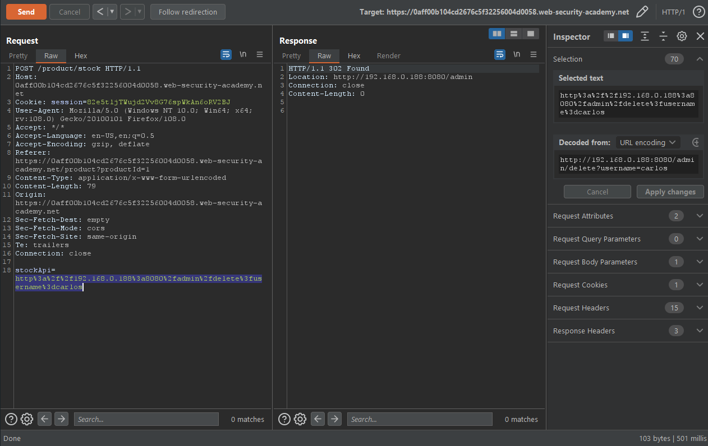
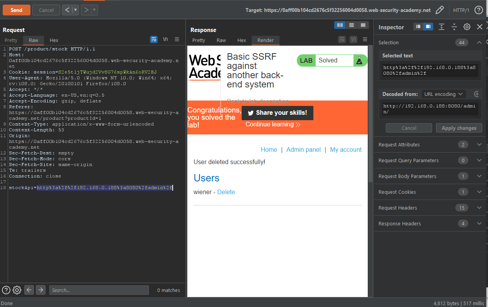

### Giải quyết
- Từ mô tả => attack vào các hệ thống backend có liên kết với server chứa ứng dụng
- Vẫn là kiểm tra chức năng chức năng `Check stock` và ném qua Burp Repeater để kiểm tra 
- Tại đây khi thay đổi URL ban đầu thành `http://192.168.0.1:8080/admin` response trả về ` Missing parameter`

- Để dò tìm đám hệ thống backend có liên kết, chuyển request qua Intruder và add payload position vào `1` và thiết lập khoảng giá trị từ 1 -> 255 để dò IP của các hệ thống có kết nối đến mục tiêu.
- Theo dõi kết quả, quan sát thấy có một thằng trả về code 200(tương ứng giá trị 188)

`=> url: http://192.168.0.188:8080/admin`
- Tiếp tục request để xóa đi tài khoản carlos `/http://192.168.0.188:8080/admin/delete?username=carlos`

- Quay lại trang admin để kiểm tra

###### Solved!
