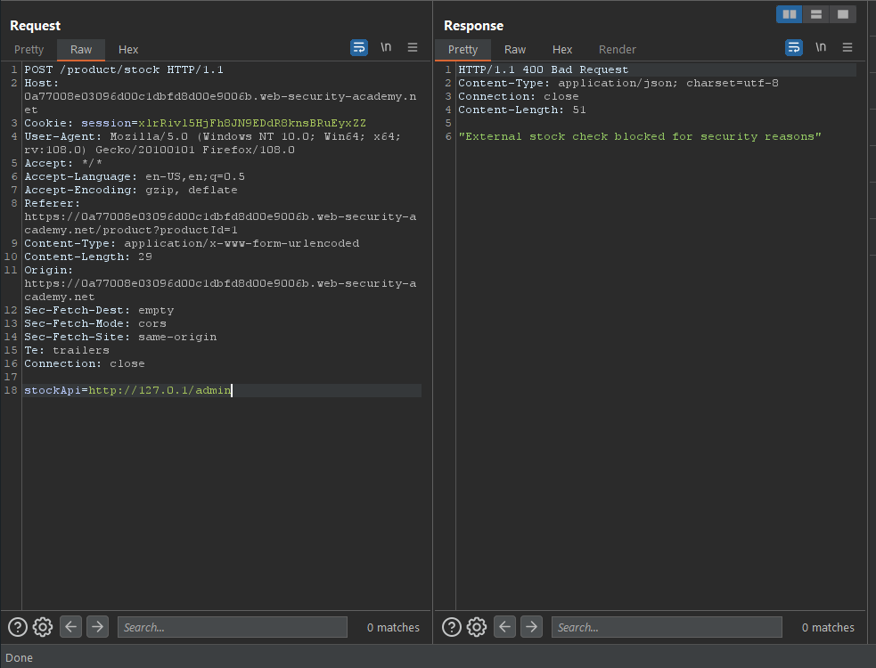

###### Giải quyết
- Tương tự như lab trước, chúng ta tiếp tục khai thác vào chức năng `Check stock`.Tuy nhiên lab này đã filter `127.0.0.1`

- Nhưng nó vẫn có thể được biểu diễn bằng cách khác có thể thử như: `127.1, 127.0.1 hay 2130706433,..`
- Chỉ có `127.1 và 127.0.1` có thể sử dụng trong phòng thí nghiệm này.

- Tiếp đến truy cập đến trang admin `/admin` nhưng có vẻ từ khóa `admin` cũng đã bị filter.

- Vậy thì thử double-URL encoding `admin` xem sao

- Bypass xong tiếp tục request xóa tài khoản 

###### Solved!