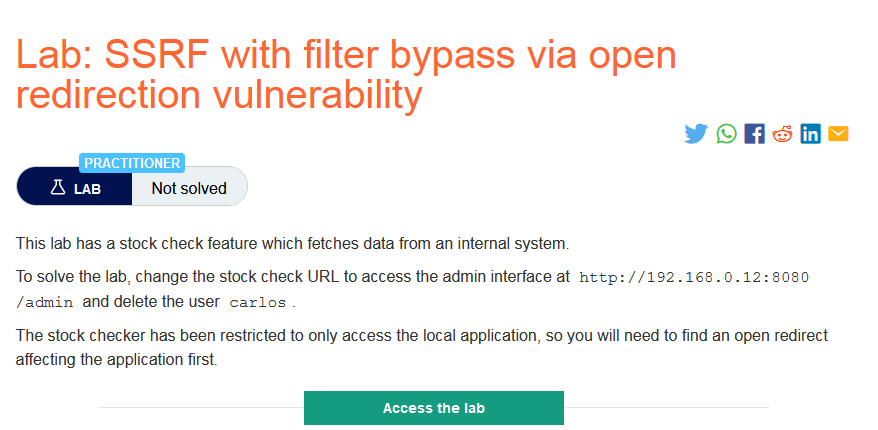
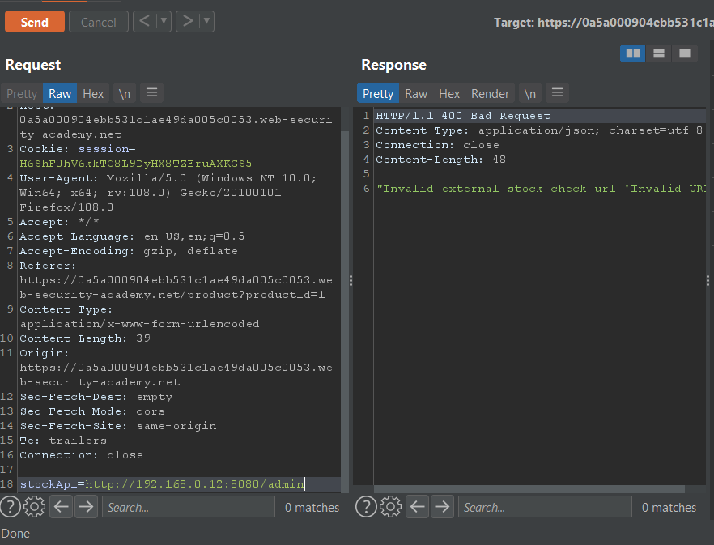
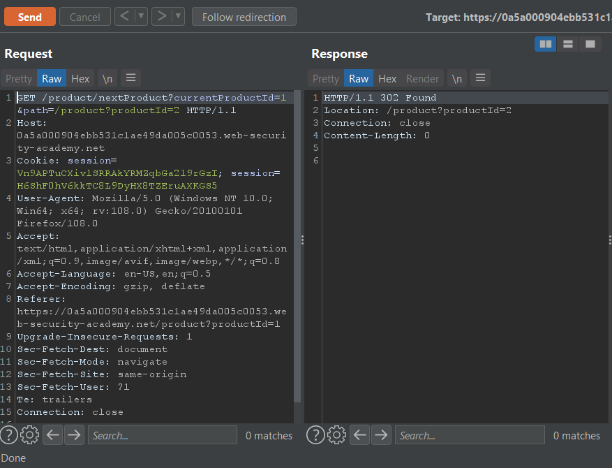
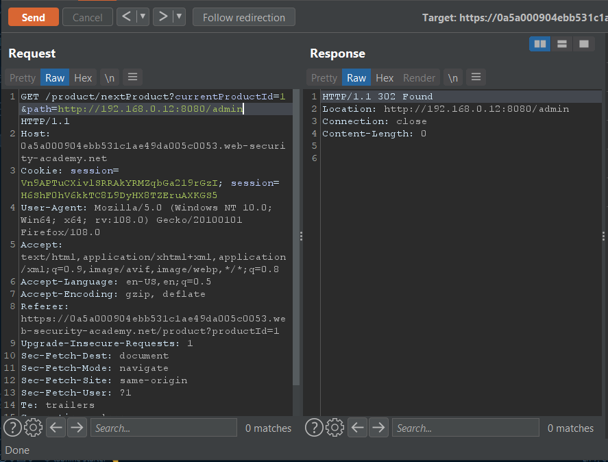
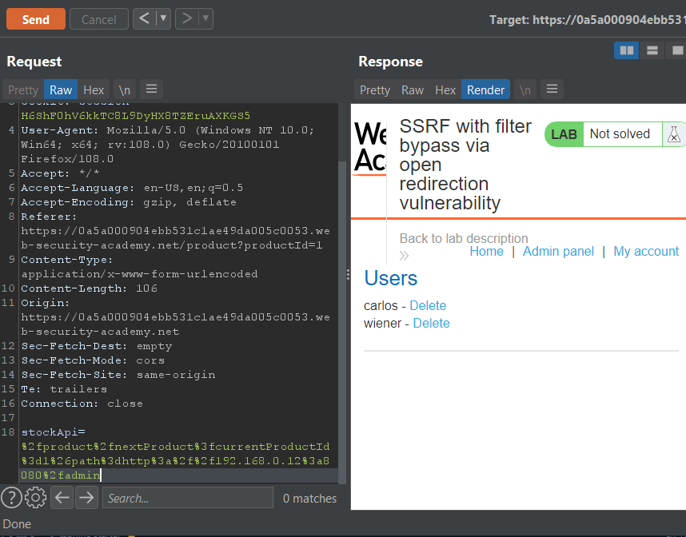
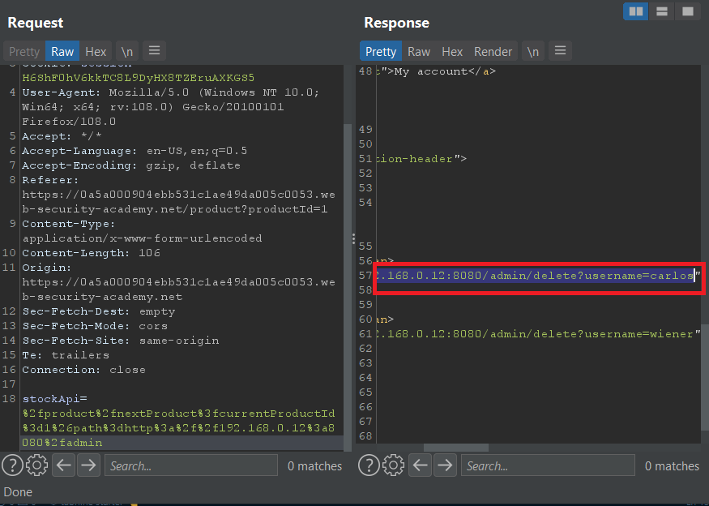
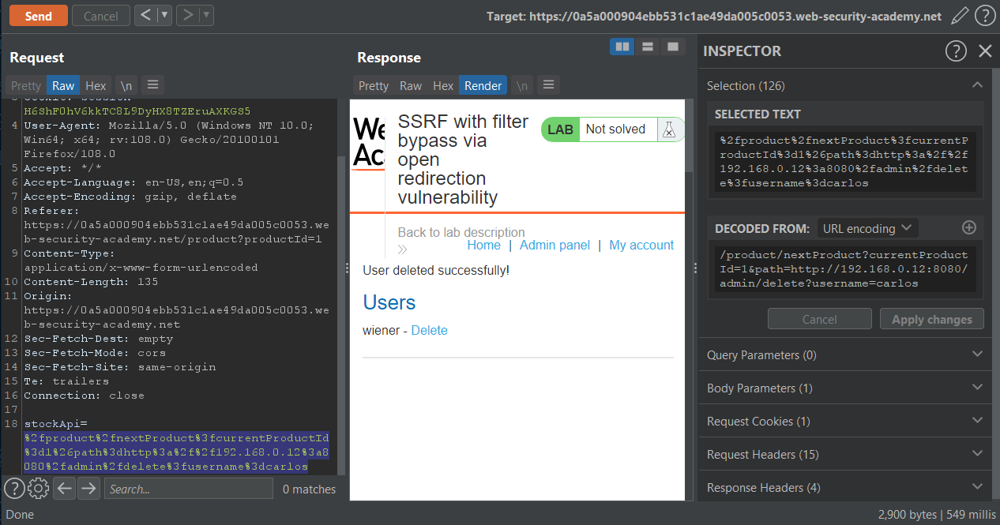

### Giải quyết
- Đầu tiên vẫn thử chức năng `Check stock` tuy nhiên lần này nó không sử dụng đường dẫn URL đầy đủ mà sử dụng 1 đường dẫn tuyệt đối.

- Quan sát thấy trang web chứa 1 chức năng mới `Next product`. Kiểm tra request của chức năng này có thể thấy nó vẫn chứa đường dẫn tới sản phầm trước và thêm 1 param `path` tới đường dẫn tuyệt đối của sản phẩm tiếp theo.

- Tới đây thử thay đổi giá trị `path` bằng 1 URL đầy đủ `http://192.168.0.12:8080/admin` và thành công

- Nhưng khi `Follow redirection` thì đã thất bại, không có gì được trả về có lẽ do HTTP request method hiện tại đang là GET 
- Vậy thì thử chuyển đường dẫn chứa path sang 1 request method POST chính là chức năng `Check stock`.

- Thành công tiếp cần admin panel, kiểm tra đường dẫn để xóa tài khoản user và thực hiện request tương tự.

###### Solved!

