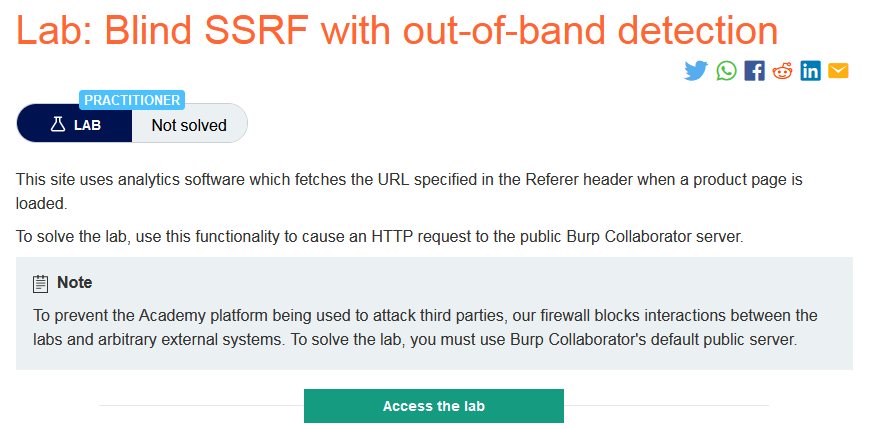
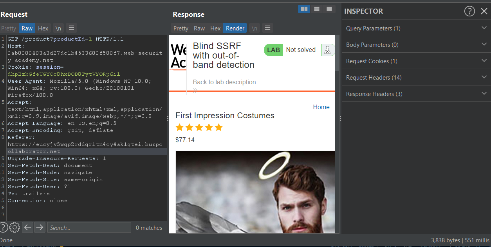
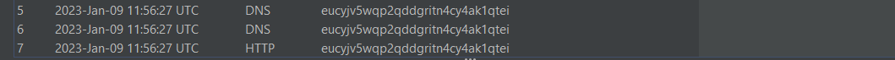
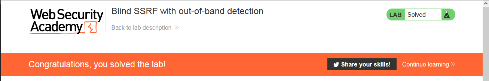

### Giải quyết
- Khác với những lab trước, phòng thí nghiệm này chỉ là 1 trang web chứa list hàng đơn thuần không có 1 chức năng gì.
- Thử đi đến 1 số sản phẩm và phân tích request, tìm kiếm những vị trí có thể tấn công SSRF.
- Ngoài tham số id sản phẩm và Referer header thì không có vị trí nào có khả năng cả.
- Sau một hồi thử với id sản phẩm thất bại mình đã chuyển sang kiểm tra `Referer header`.
- Để có thể dễ dàng theo dõi kết quả của những lần kiểm tra mình đã sử dụng `Burp Collaborator client`. Cập nhật giá trị `Referer header` thành domain copy bên `Burp Collaborator client` và gửi request đi.

- Sau đó quay lại với `Burp Collaborator client` đã có kết quả xuất hiện

- Dựa vào kết quả tương tác này, có thể khai thác các thông tin cần thiết hoặc làm bàn đạp cho các lần tấn công tiếp theo

###### Solved!