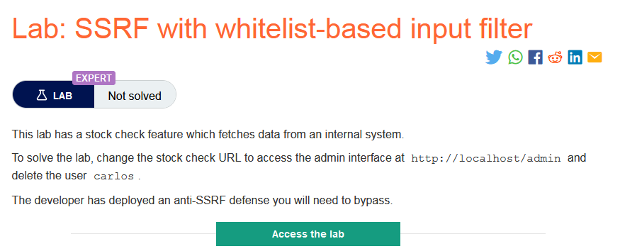

### Giải quyết
- Trước hết, bấm vào 1 sản phẩm bất kỳ và thử chức năng `Check stock`, bắt request và thay đổi giá trị `stockApi` thành `http://localhost/admin` ,send request và thất bại.

- Từ response quan sát có thể thấy ứng dụng web đã triển khai whitelist filter và host yêu cầu phải có kiểu `stock.weliketoshop.net`
- Sau khi tìm kiếm phân tích về URL `parse URL` tôi tìm thấy thứ khá hay ho để vượt qua cái rào kia

- Vì thế tôi đã thử dùng `#` và `@` `http://localhost#@stock.weliketoshop.net`
    - Lúc này cai `@` là để lấy host yêu cầu vượt qua cái rào kia, còn `#` dùng để phân đoạn cái URL gọt bỏ cái đằng sau để chỉ còn lại là `http://localhost`
- Tuy nhiên vẫn thất bại

- Sau đó tôi đã thử `double encoding` cả cái đường dẫn đó không được lại thử đến 2 ký tự đặc biệt kia. Cuối cùng thành công khi  `double encoding #` 

- Rồi tiếp theo cố gắng chui vào `/admin` theo như cái hình `parse URL` kia thì `path` nằm sau thằng `hostname` 

- Cuối cùng xóa tài khoản `carlos`

- Quay lại `/admin` kiểm tra 

###### Solved!