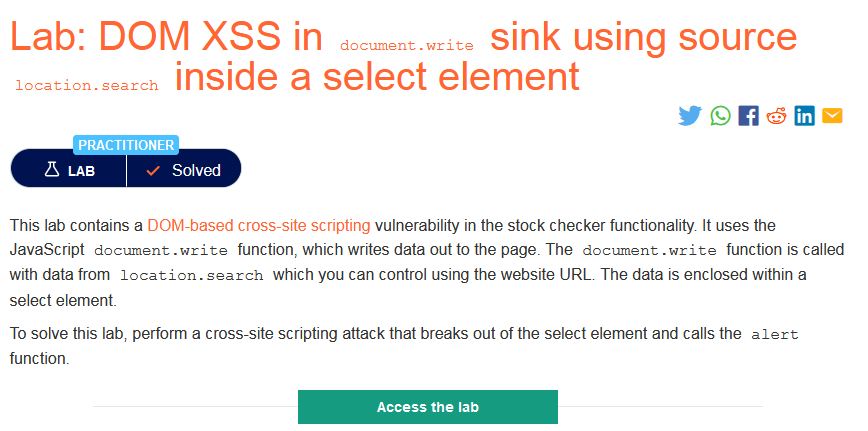
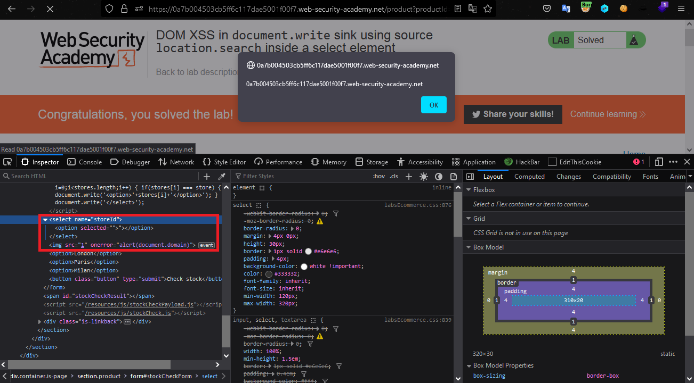

### Giải quyết
- Phòng thí nghiệm chứa lỗ hổng DOM XSS trong chức năng `Check stock`.
- `View page source` chúng ta thấy 1 đoạn `script` liên quan đến `Check stock` và request gửi đi Burp bắt được như sau:

- Sau khi lấy giá trị của `storeId` từ URL, đã thực hiện ghi ra ngay giá trị đó trong thẻ `select` mà không hề có filter gì => lợi dụng nó có thể chèn 1 đoạn `script` độc hại. Payload `productId=1&storeId="></select>`

###### Solved!
