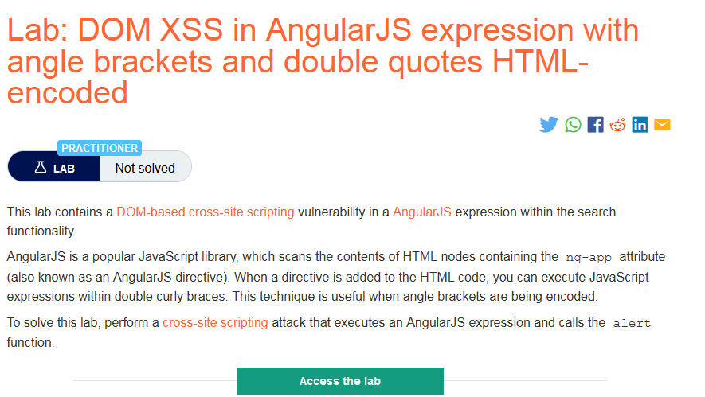
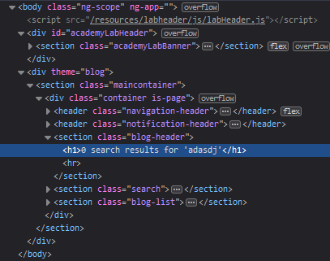
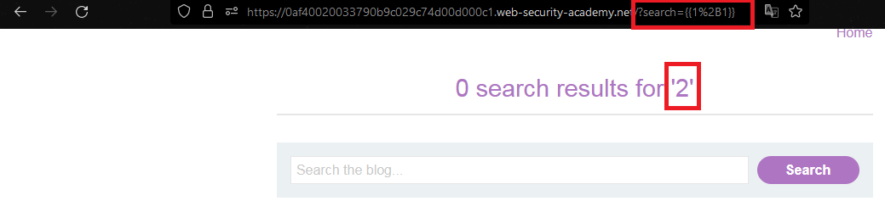
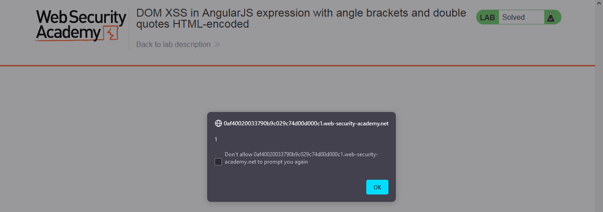

### Giải quyết
- Phòng thí nghiệm chứa lỗ hổng DOM XSS trong AngularJS expression ở chức năng tìm kiếm
- AngularJS là một trong những thư viện phổ biến của JavaScript có thể rà quét nội dung HTML chứa ng-app attribute (còn được gọi là AngularJS directive). Khi có directive được bổ sung vào HTML code, attacker sẽ có thể thực thi JavaScript code trong double curly braces `{{}}`.
- Cụ thể, kiểm tra source code trang web khi tìm kiếm thì giá trị tìm kiếm nằm bên trong ng-app directive 

- Tiếp đến thử inject 1 biểu thức ví dụ như `{{1+1}}` nếu kết quả = 2 tức là biểu thức bên trong `{{}}` đã được thực thi

- Cuối cùng inject payload gọi alert: `{{constructor.constructor('alert(1)')()}}  `

###### Solved!

