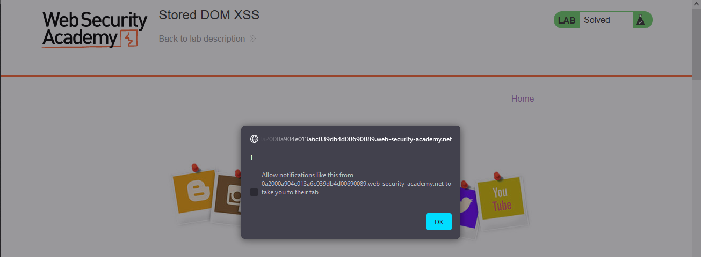

### Giải quyết
- Phòng thí nghiệm chứa lỗ hổng DOM XSS được lưu trữ bên server tại chức năng bình luận blog. 
- Trước tiên thử inject 1 đoạn script gọi alert trong chức năng bình luận

- Có thể thấy thẻ đóng `</script>` đã biến mất 1 cách lạ thường, thử inject nhiều thẻ hơn xem điều gì sẽ xảy ra

- Và chỉ có thẻ đầu tiên không hoạt động còn lại đều tốt. Có thể `<>` đã bị encode và sau đó trình duyệt đã bỏ qua `</>` 
- Thử payload `<>`

###### Solved!

