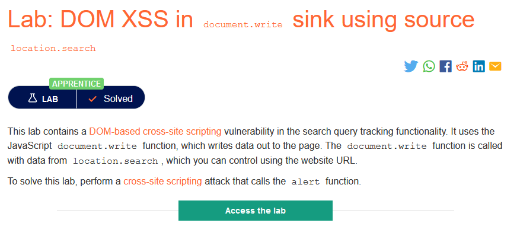
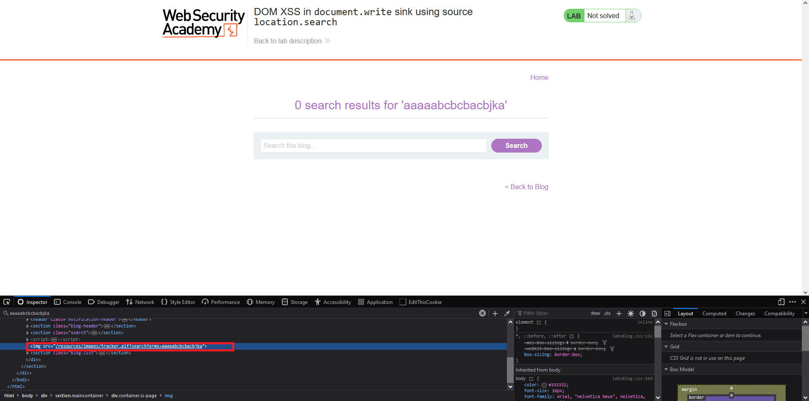
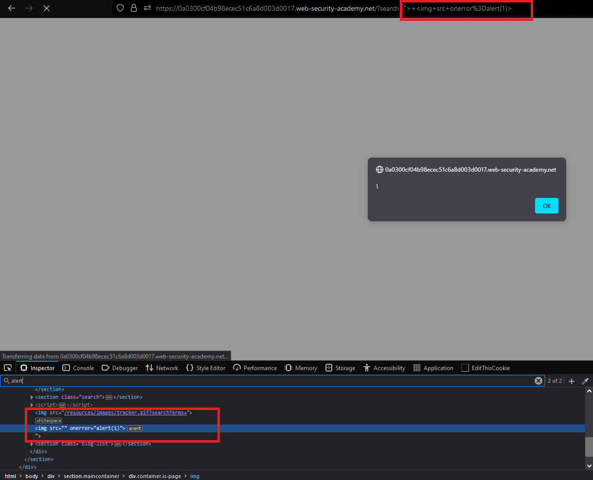

### Giải quyết
- `This lab contains a DOM-based cross-site scripting vulnerability in the search query tracking functionality`. Đầu tiên bắt đầu với chức năng tìm kiếm

- Có thể thấy đoạn ký tự linh tinh nhập vào tìm kiếm đã được nhét cào trong thẻ `img` => có thể sửa đổi cấu trúc DOM bằng cách đóng thẻ `img` có sẵn sau đó chèn 1 thẻ khác.

###### Solved!
