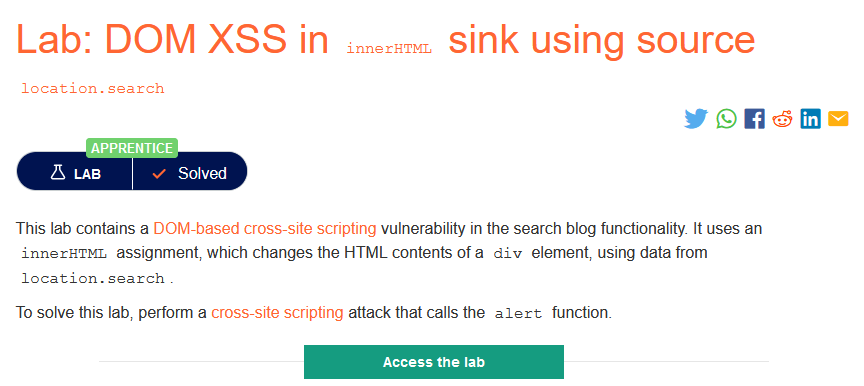
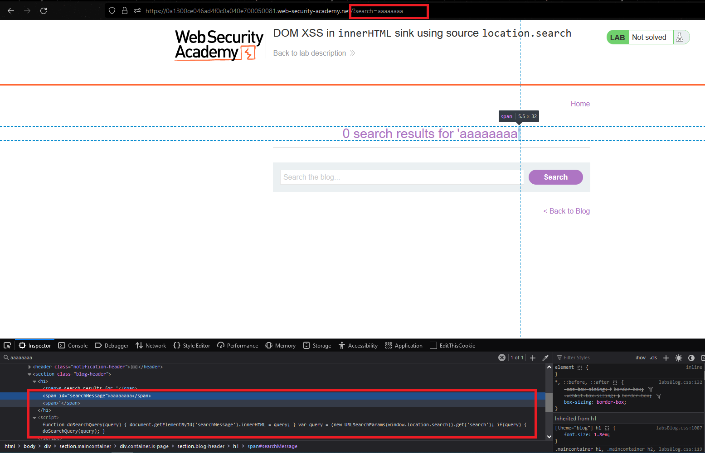
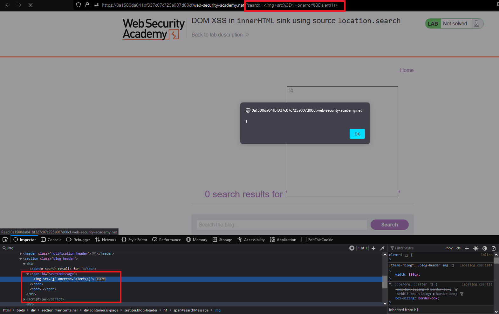

### Giải quyết
- Ở lab này, dữ liệu từ `location.search` sẽ được đẩy vào để thay đổi nội dung của một `div element` cụ thể thông qua `innerHTML assignment`.

```
=> có thể chèn đoạn script trong 1 thẻ html:

```

###### Solved!