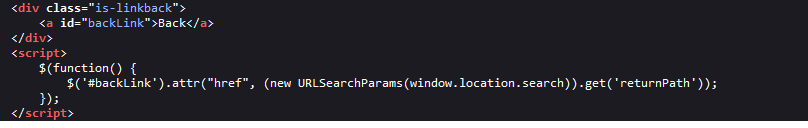
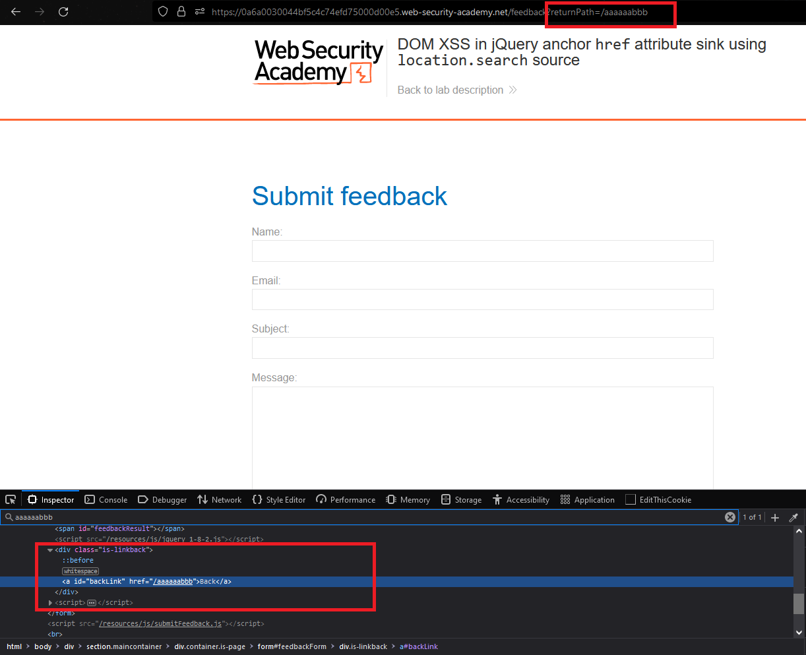
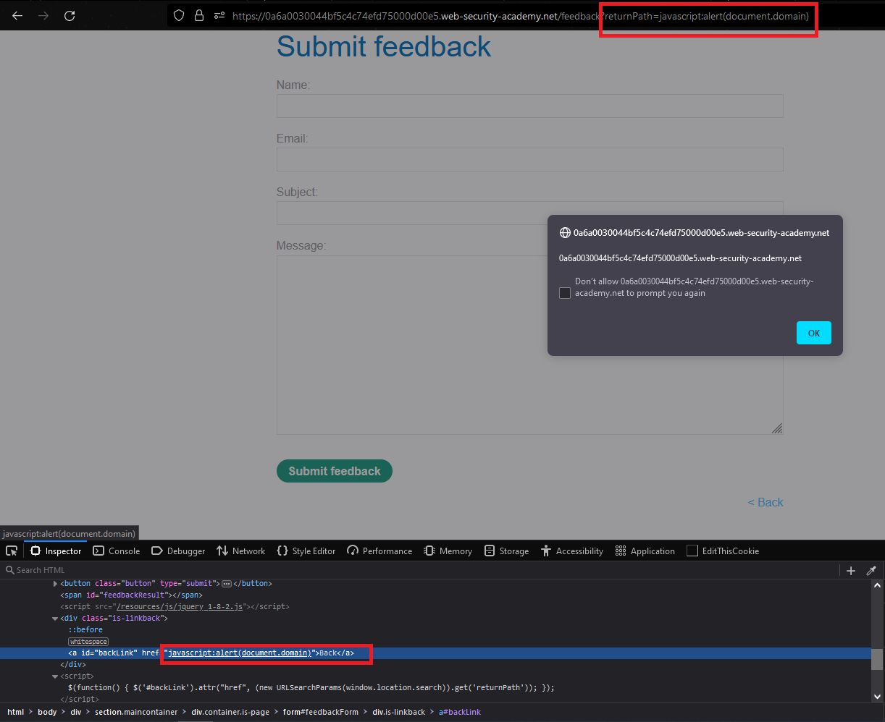

### Giải quyết 
- Ứng dụng chứa lỗ hổng DOM-XSS trong chức năng `Feedback`
- Nó sử dụng `jQuery library selector function ($)` để tìm phần tử neo và thay đổi thuộc tính href của nó bằng cách sử dụng dữ liệu từ location.search

- Thử nghiệm: 
    - Thay đổi `returnPath` bằng 1 đoạn ký tự linh tinh bất kỳ và `inspect` để tìm lại đoạn ký tự đó để xem nó có được đẩy vào `href` không
    
- Sau khi thử nghiệm ok thì có thể thay bằng 1 đoạn script kiểu như `javascript:alert(document.domain)`. Sau đó click vào `Back` button, popup thông báo hiện ra là thành công.

###### Solved!