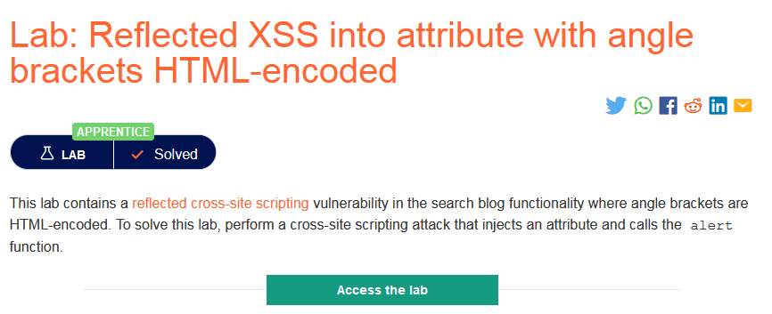
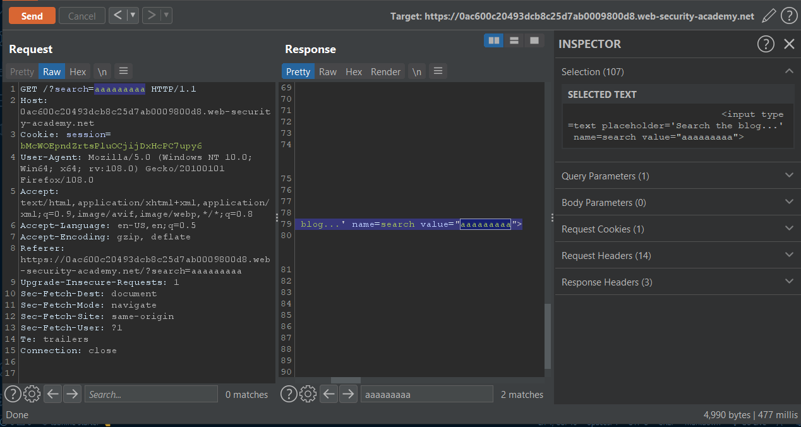
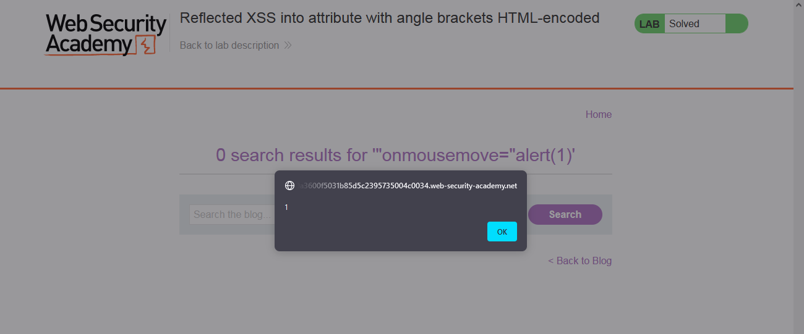

### Giải quyết
- Phòng thí nghiệm chứa lỗ hổng Reflected XSS trong chức năng tìm kiếm và chỉ dấu ngoặc nhọn bị mã hóa HTML.
- Trước hết thử tìm kiếm 1 đoạn ký tự bất kỳ và kiếm tra những vị trí nó được nhúng trong response.

- Có thể thấy giá trị được nhúng trong trường `value` của thẻ `input` và sẽ bị mã hóa dấu ngoặc nhọn.
`=> để kích hoạt Reflected XSS chỉ cần đóng trường value và sử dụng 1 event bất kỳ sau đó như onmousedown, onmouseover,... `

###### Solved!
