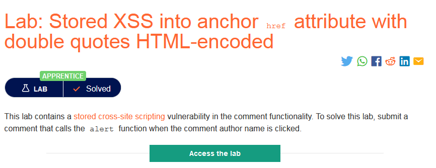
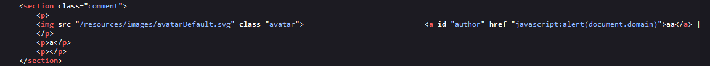
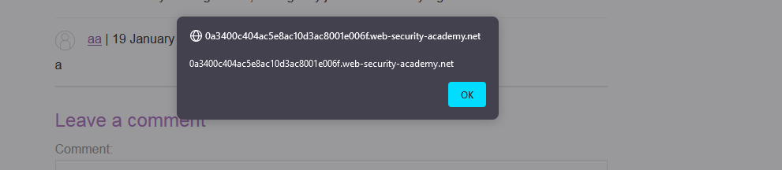

- Phòng thí nghiệm chứa lỗ hổng Stored XSS trong chức năng nhận xét.
- Lần này trường `comment` hiển thị ra đã được đặt trong thẻ `p`.
- Thử tiếp các trường khác thì đến `Website` không có yêu cầu phải điền đúng form là 1 url nhưng dấu ngoặc kép đã bị mã hóa để tránh việc inject 1 event dẫn đến Reflected XSS
- Tuy nhiên vẫn có thể `alert` bằng cách chèn 1 URL Javascript `javascript:alert(document.domain)`

- Sau đó click vào link để kích hoạt payload đã inject.

###### Solved!
