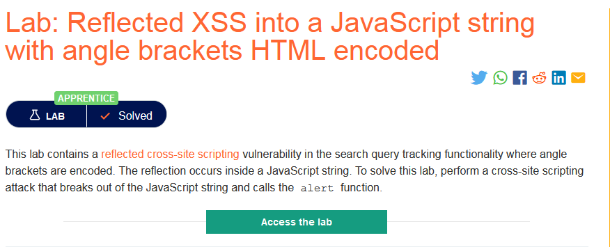
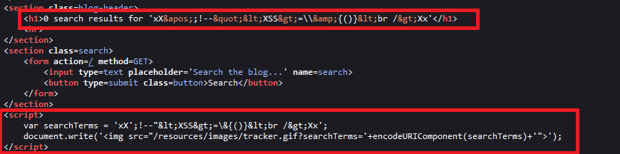
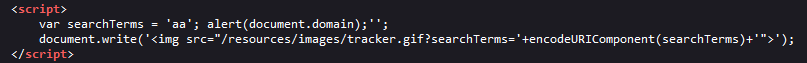
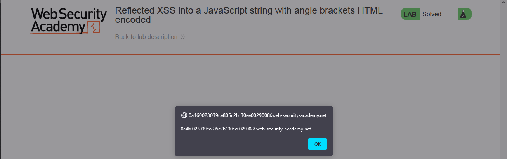
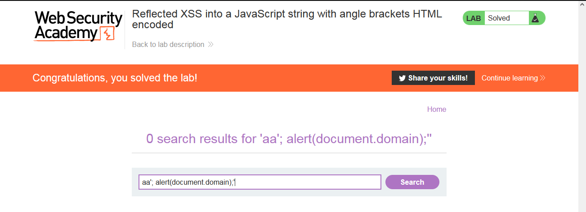

### Giải quyết
- Phòng thí nghiệm chứa lỗ hổng Reflected XSS trong chức năng năng tìm kiếm.
- Trước hết thử sử dụng chức năng tìm kiếm 1 vài ký tự đặc biệt và xem những vị trí của nó trong phản hồi

- Dầu ngoặc nhọn đã bị encode, vị trí đầu tiên nằm trong thẻ `h1`. Vị trí thứ 2 là trong thẻ `script` => đây là vị trí có thể tấn công với payload khá đơn giản `aa'; alert(document.domain);'`

###### Solved!
