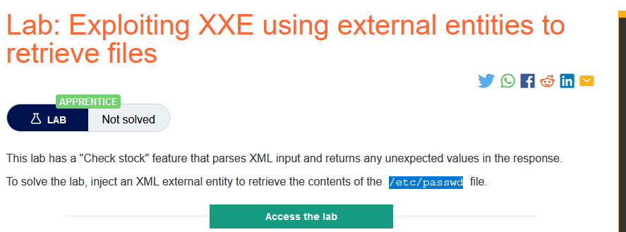
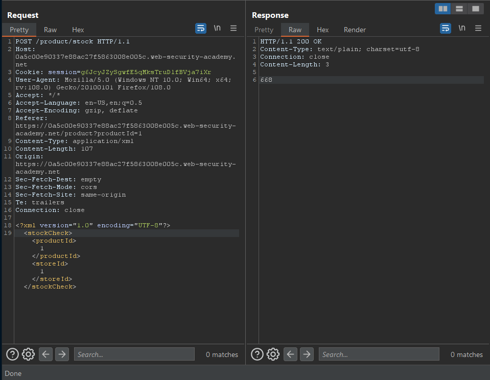
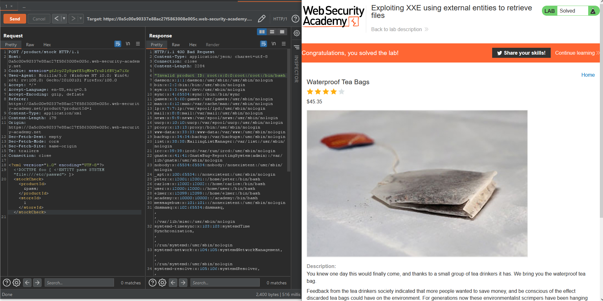

### Giải quyết 
- Mô tả cho biết chức năng `Check stock` của ứng dụng web sử dụng tính năng phân tích cú pháp của XML và trả về bất kể giá trị không mong muốn nào trong phản hồi.
- Lợi dụng điều đó chúng ta có thể thực hiện truy xuất nội dung file `/etc/passwd` để hoàn thành phòng thí nghiệm này.
-  Đầu tiên, kiểm tra chức năng `Check stock`

- Sau đó thực hiện thay đổi payload gửi đi:
```
<?xml version="1.0" encoding="UTF-8"?>
<!DOCTYPE foo [ <!ENTITY pass SYSTEM "file:///etc/passwd"> ]>
<stockCheck><productId>&pass;</productId><storeId>1</storeId></stockCheck>
```

- Payload XXE này xác định một thực thể bên ngoài &pass. Sử dụng giao thức file:// có giá trị là nội dung của tệp /etc/passwd và sử dụng thực thể bên trong là productId . Khi ứng dụng thực hiện phân tích dữ liệu XML với phần DTD như trên, trình phân tích sẽ đọc nội dung tệp /etc/passwd trong hệ thống và gán vào biến &pass. Sau đó giá trị của &pass hiển thị thông qua productId.
###### Solved!

