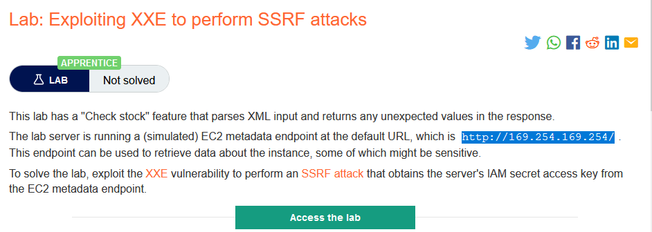
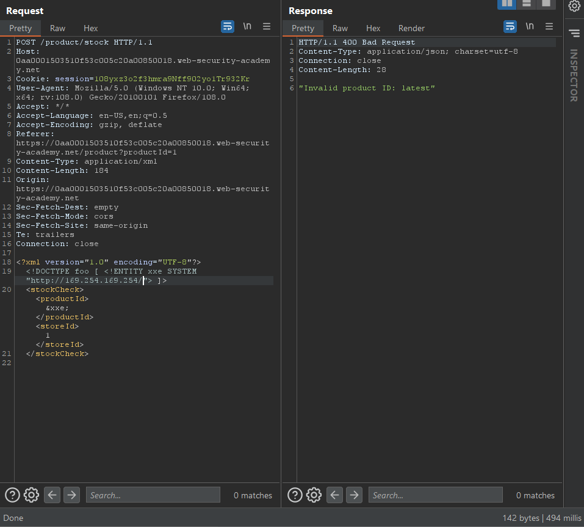
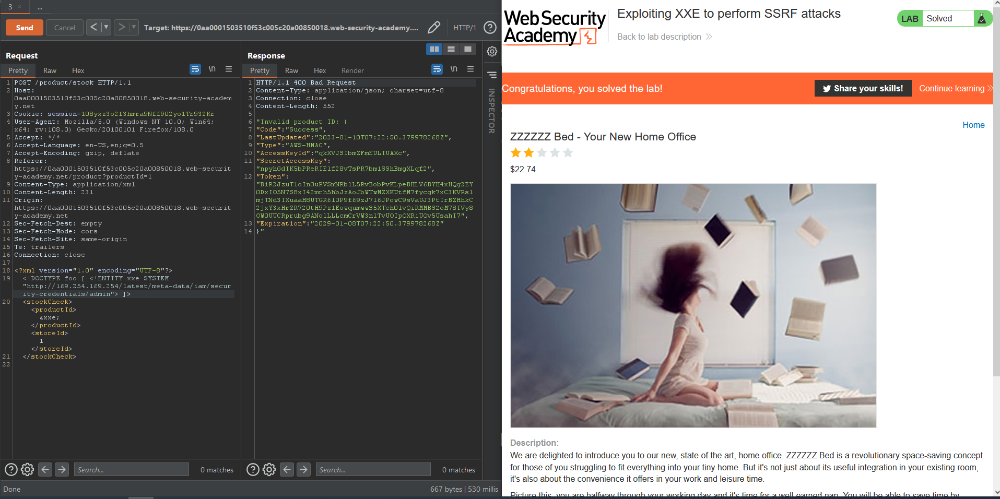

### Giải quyết
- Tương tự như lab1, tuy nhiên lần này thay bằng 1 URL và sau khi request, response trả về ít thông tin

- Dữ liệu trả về `latest` cho biết đường dẫn tiếp theo. Cứ thế cuối cùng chúng ta sẽ có 1 đường dẫn hoàn chỉnh

###### Solved!

