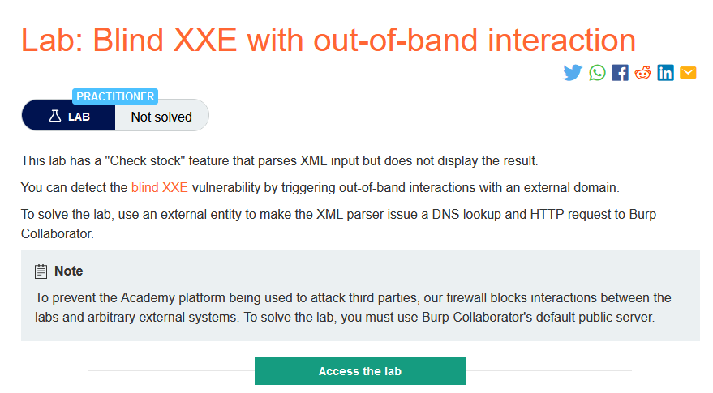
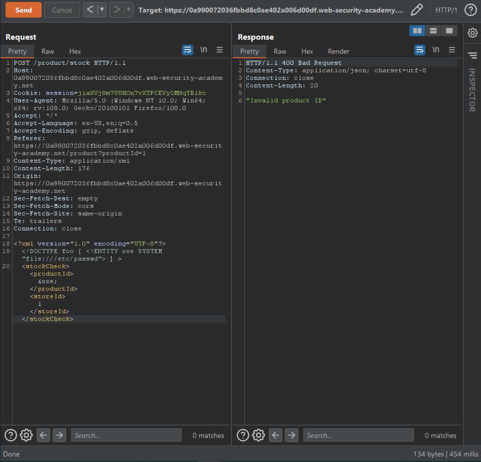
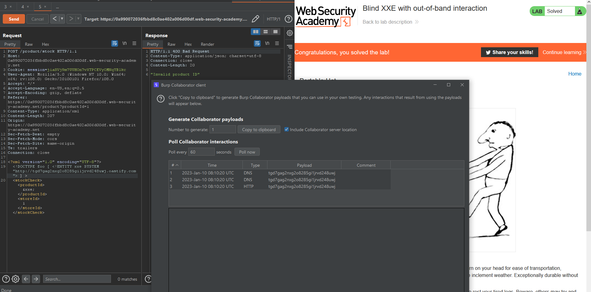

### Giải quyết
- Từ mô tả và qua thử nghiệm chức năng `Check stock`,khi thử inject 1 payload khác thì kết quả trả về không có gì ngoài `Invalid product ID`

` => Blind xxe => Kiểm tra bằng cách sử dụng OAST gửi 1 http request đến doamin Burp Collaborator `

###### Solved!